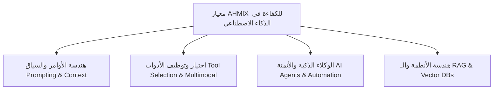

# ⚡ AHMIX AI Professional Certification Standard
### شهادة احترافية ومعيار معتمد في استخدام وتطبيقات الذكاء الاصطناعي

[](https://github.com/ahmed28e/AHMIX-AI-Certification)
[](LICENSE)
[](https://github.com/ahmed28e/AHMIX)
[](#-التحقق-من-صحة-الشهادة)

---

## 🌟 نظرة عامة (Overview)

**شهادة AHMIX في الذكاء الاصطناعي** هي معيار تطبيقي واحترافي تم تأسيسه استناداً إلى مرجع وقاعدة معرفة **[AHMIX AI Platform](https://github.com/ahmed28e/AHMIX)** التي طورها **المهندس أحمد عبد الفتاح (Ahmed Abdel Fattah)**.

يهدف هذا المشروع لتوثيق وتقييم الجدارة والمهارات التطبيقية للمهندسين والمطورين في:
1. **استغلال أحدث نماذج الذكاء الاصطناعي (LLMs & Foundation Models)**
2. **صياغة الأوامر المتقدمة (Advanced Prompt Engineering)**
3. **أتمتة الأعمال وسلاسل العمل الذاتية (Autonomous AI Agents & Workflows)**
4. **تكامل أدوات الذكاء الاصطناعي متعددة الوسائط (Multimodal AI Tools)**
5. **معايير الأمان، الدقة، وحماية البيانات (AI Safety & Ethics)**

---

## 🏛️ ركائز معيار AHMIX (Core Pillars)



### 1. هندسة السياق والأوامر المتقدمة
- إتقان أساليب التحفيز المنطقي: `Chain-of-Thought (CoT)`, `Tree-of-Thoughts`, `Few-Shot`, `ReAct`.
- هندسة النوافذ السياقية وتقليل الهلوسة (Hallucination Mitigation).

### 2. الكفاءة في منصة وأدوات AHMIX
- توظيف أكثر من 50 أداة رائدة مفهرسة في مرجع AHMIX عبر تصنيفاتها (توليد الصور، الأكواد، الإنتاجية، الصوتيات، وتحليل البيانات).
- المفاضلة الذكية بين النماذج من حيث السرعة والتكلفة والجودة (Trade-off Optimization).

### 3. الوكلاء الذاتيون والأتمتة
- تصميم وكلاء مستقلين قادرين على استدعاء الأدوات الخارجية (Tool Use / Function Calling).
- بناء بيئات عمل ذكية تنجز المهام البرمجية والهندسية ذاتياً.

---

## 🎓 مسارات الشهادة المعتمدة

| المسار التخصصي | الرمز | المستهدفون |
| :--- | :---: | :--- |
| **هندسة وتطبيقات أنظمة الذكاء الاصطناعي** | `AHMIX-AI-SYS` | مهندسو البرمجيات والأنظمة والذكاء الاصطناعي |
| **هندسة الأوامر المتقدمة والأتمتة الذكية** | `AHMIX-AI-PE` | المطورون ومصممو مسارات العمل المؤتمتة |
| **الذكاء الاصطناعي التوليدي والوسائط المتعددة** | `AHMIX-AI-GEN` | المبدعون، المصممون، وصناع المحتوى الرقمي |
| **أخصائي وكلاء الذكاء الاصطناعي وأنظمة RAG** | `AHMIX-AI-RAG` | مهندسو البيانات ومعماريو أنظمة استرجاع المعرفة |

---

## 💻 التشغيل والمعاينة المحلية (Quick Start)

المشروع مصمم بمعمارية خفيفة بدون أي تبعيات معقدة (Vanilla HTML5 / CSS3 / JavaScript):

```bash
# استنساخ المستودع
git clone https://github.com/ahmed28e/AHMIX-AI-Certification.git
cd AHMIX-AI-Certification

# فتح الملف مباشرة في المتصفح أو عبر خادم محلي:
python -m http.server 3000
```
ثم توجه في متصفحك إلى: `http://localhost:3000`

---

## 🔍 التحقق من صحة الشهادة (Verification Protocol)

كل شهادة صادرة تحتوي على معرف فريد بنمط:
`AHMIX-AI-2026-XXXX`

يمكن لأي جهة توظيف أو مؤسسة أكاديمية إدخال المعرف في بوابة التحقق التفاعلية بالصفحة للتأكد من حالة الاعتماد ومطابقته لسجلات مرجع AHMIX.

---

## 👤 المؤسس والمطور (Creator)

- **المهندس أحمد عبد الفتاح** ([@ahmed28e](https://github.com/ahmed28e))
- مهندس أنظمة وذكاء اصطناعي (AI & Systems Engineer)
- المرجع الأساسي للمشروع: [AHMIX Platform Repository](https://github.com/ahmed28e/AHMIX)

---

## 📄 الترخيص (License)
هذا المشروع مرخص تحت رخصة [MIT License](LICENSE).
